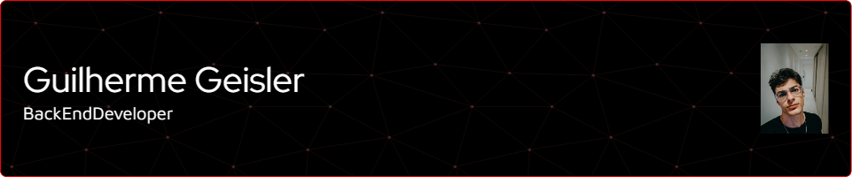

# Hi 👋 I'm Guilherme Geisler

[;%3CFront-end+developer+focused+on+modern+web+interfaces;%3CComputer+Science+student+at+FURB;%3CLooking+for+my+first+opportunity+as+a+developer!)](https://git.io/typing-svg)

---

<table>
  <tr>
    <td style="vertical-align: middle;">
      - 🎨 Focused on <strong>Front-end Development</strong> with modern web technologies. 
      - ⚛️ Currently studying <strong>React</strong> and <strong>Node.js</strong> to build full-stack applications. 
      - 🐍 Learning <strong>Python for AI</strong> for academic projects. 
      - ☕ Background in <strong>Java</strong> and <strong>Spring</strong> for back-end support. 
      - 🧠 Improving my <strong>soft skills</strong> through training programs at <strong>RocketSeat 🚀</strong>. 
      - 🎓 Computer Science student at the <strong>Regional University of Blumenau (FURB)</strong>.
    </td>
    <td align="right" style="padding-left: 20px; vertical-align: middle;">
      
    </td>
  </tr>
</table>

---

## 🔗 Connect with Me

  
  

---

## 🛠️ Languages and Tools

### 🎨 Frontend

  
  
  
  
  

### 🧠 Backend (support)

  
  
  
  

### 🗄️ Database

  
  

### ⚙️ Tools

  
  

---

## 📊 GitHub Stats

---

## 🏆 GitHub Trophies

---

## 🎓 Certifications & Badges

  
  
  

---

  

